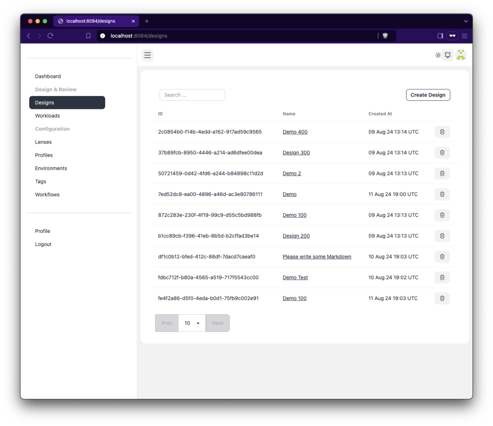

# Service Lens :eyeglasses:

[](https://github.com/zeiss/service-lens/actions/workflows/main.yml)
[](https://twitter.com/SwiftOnSecurity)
[](https://github.com/auchenberg/volkswagen)
[](https://opensource.org/licenses/Apache-2.0)

> :warning: This project is in early development. It is not ready for production use.

## About

Service Lens is an enterprise service management tool. It allows you to manage your services, identify risks, review the solutions that created them and the business context of every service. It follows the Well-Architected methodology established by AWS and Microsoft.



It is build on [fiber-htmx](https://github.com/ZEISS/fiber-htmx) and uses a 3-tier architecture.

## Lens Format

### Overview

This JSON schema defines the structure for evaluating a system against best practices. It includes various pillars, each containing questions, choices, risks, and resources.

### Schema Structure

#### Root Object
- **version**: (integer) The version of the schema.
- **name**: (string) The name of the lens.
- **description**: (string) A description of the lens.
- **pillars**: (array) A list of pillars.

#### Pillar Object
- **ref**: (string) A reference identifier for the pillar.
- **name**: (string) The name of the pillar.
- **description**: (string) A description of the pillar.
- **questions**: (array) A list of questions related to the pillar.
- **resources**: (array) A list of resources related to the pillar.

#### Question Object
- **ref**: (string) A reference identifier for the question.
- **title**: (string) The title of the question.
- **description**: (string) A description of the question.
- **resources**: (array) A list of resources related to the question.
- **choices**: (array) A list of choices for the question.
- **risks**: (array) A list of risks associated with the question.

#### Resource Object
- **url**: (string) The URL of the resource.
- **description**: (string) A description of the resource.

#### Choice Object
- **ref**: (string) A reference identifier for the choice.
- **title**: (string) The title of the choice.
- **description**: (string) A description of the choice.

#### Risk Object
- **risk**: (string) The risk level.
- **condition**: (string) The condition under which the risk applies.

#### Example

```json
{
  "version": 1,
  "name": "SAP Lens",
  "description": "This evaluates an SAP against best practices.",
  "pillars": [
    {
      "ref": "operational_excellence",
      "name": "Operational Excellence",
      "description": "Operational Excellence",
      "questions": [
        {
          "ref": "question_1",
          "title": "Question 1 - A longer title for the lens.",
          "description": "Question 1 asks about operational exelence",
          "resources": [
            {
              "url": "https://de.wikipedia.org/wiki/Operational_Excellence",
              "description": "Operational excellence is a mindset that embraces certain principles and tools to create a culture of excellence within an organization. Operational excellence means every employee can see, deliver, and improve the flow of value to a customer."
            }
          ],
          "choices": [
            {
              "ref": "choice_1",
              "title": "Choice 1",
              "description": "Choice 1 is provding a good choice."
            },
            {
              "ref": "choice_2",
              "title": "Choice 2",
              "description": "Choice 2 is provding a good choice."
            },
            {
              "ref": "choice_3",
              "title": "Choice 3",
              "description": "Choice 3 is provding a good choice."
            },
            {
              "ref": "none_of_these",
              "title": "None of these",
              "description": "None of these"
            }
          ],
          "risks": [
            {
              "risk": "NO_RISK",
              "condition": "choice_1 && choice_2 && choice_3"
            },
            {
              "risk": "MEDIUM_RISK",
              "condition": "(choice_1 || choice_2) && choice_3"
            },
            {
              "risk": "HIGH_RISK",
              "condition": "default"
            }
          ]
        }
      ],
      "resources": [
        {
          "url": "https://de.wikipedia.org/wiki/Operational_Excellence",
          "description": "Operational excellence is a mindset that embraces certain principles and tools to create a culture of excellence within an organization. Operational excellence means every employee can see, deliver, and improve the flow of value to a customer."
        }
      ]
    }
  ]
}
```

This schema provides a structured way to evaluate the design, operations and risks of a system.

## Development

Please, set all environment variables in `.env`. `docker compose up db` will launch a local development database.

```
air
```

This launches a development instance of the application.

# License

[LICENSE](./LICENSE)
